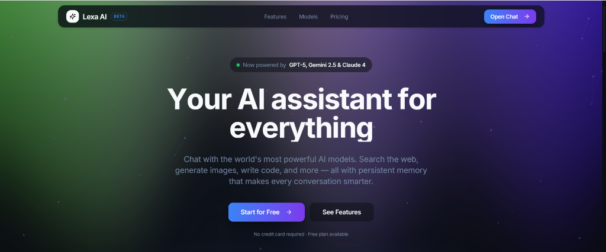
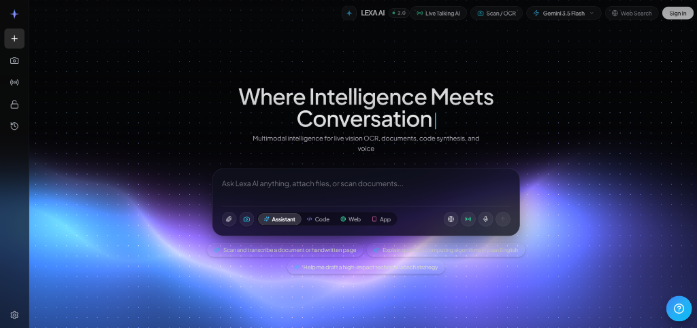

<div align="center">

  

  <br /><br />

  # 🌐 World's First AI-Powered Portfolio 🤖✨
  
  **An interactive, next-generation AI portfolio that talks back, showcases live projects, and answers questions dynamically with an expressive Memoji avatar.**

  <br />

  <p align="center">
    <a href="https://ai-powered-portfolio-hhtog8xoz-parag1617.vercel.app">
      
    </a>
    <a href="https://github.com/parag8451/AI-powered-portfolio">
      
    </a>
  </p>

  <p align="center">
    
    
    <a href="https://nextjs.org/"></a>
    <a href="https://react.dev/"></a>
    <a href="https://tailwindcss.com/"></a>
    <a href="https://mistral.ai/"></a>
    <a href="https://github.com/parag8451/AI-powered-portfolio/stargazers"></a>
  </p>

</div>

---

## 💡 About The Project

Static portfolios are a thing of the past. They present a one-sided, static view of a developer's journey. **AI-Powered Portfolio** was engineered to break that mold.

Instead of forcing recruiters, developers, and visitors to scroll endlessly through generic bullet points, this portfolio transforms the experience into a **dynamic, conversational AI interface**. Visitors can ask questions about technical skills, project architectures, background, and work experience — receiving instant, context-aware answers paired with rich UI cards, 3D interactive carousels, and visual showcases.

> *"A portfolio that doesn't just show — it communicates."*

---

## 📸 Screenshots & Visual Experience

### 🖥️ Interactive Homepage & AI Chat Interface

<div align="center">
  <table>
    <tr>
      <td width="50%" align="center">
        <b>Landing Hero & Dynamic Query Launcher</b><br/><br/>
        
      </td>
      <td width="50%" align="center">
        <b>Interactive Talking Memoji & AI Stream</b><br/><br/>
        
      </td>
    </tr>
  </table>
</div>

### 🚀 Featured Project Showcases (e.g. Lexa AI)

<div align="center">
  <table>
    <tr>
      <td width="50%" align="center">
        <b>Lexa-AI Modern Landing Platform</b><br/><br/>
        
      </td>
      <td width="50%" align="center">
        <b>Lexa-AI Multimodal Workspace & OCR</b><br/><br/>
        
      </td>
    </tr>
  </table>
</div>

---

## ✨ Key Features

* 🗣️ **Interactive Talking AI Avatar:** Real-time conversational AI streaming responses backed by Mistral AI and Vercel AI SDK.
* 🧠 **Smart Tool Calling & Dynamic Components:**
  * `getPresentation` — Renders an interactive introduction card with animated details.
  * `getProjects` — Launches Apple-style 3D expandable project cards.
  * `getSkills` — Displays interactive categorized tech stack badges.
  * `getContact` — Offers one-click direct communication options.
* 🎨 **State-of-the-Art Design System:**
  * Modern Dark & Light Mode toggle with persistence.
  * Fluid WebGL cursor effects and interactive particles (`@tsparticles`).
  * Glassmorphism, smooth gradients, and custom Framer Motion transitions.
* ⚡ **Ultra-Fast Performance:** Built on **Next.js 15 App Router** and **React 19** with server-side optimizations.
* 📱 **Fully Responsive & Accessible:** Designed to look flawless on mobile, tablet, and ultra-wide screens.

---

## 🛠️ Tech Stack & Architecture

| **Layer** | **Technology** | **Description** |
| :--- | :--- | :--- |
| **Framework** | [Next.js 15 (App Router)](https://nextjs.org/) | Production React framework with server components and edge rendering |
| **Core Library** | [React 19](https://react.dev/) | Latest React with optimized rendering and state transitions |
| **Styling** | [Tailwind CSS v4](https://tailwindcss.com/) | Modern utility-first CSS styling engine |
| **Animations** | [Framer Motion](https://www.framer.com/motion/) / Motion | Fluid physics-based micro-interactions and transitions |
| **AI SDK** | [Vercel AI SDK](https://sdk.vercel.ai/) & [Mistral AI](https://mistral.ai/) | Streaming responses and structured tool invocations |
| **UI Components** | [shadcn/ui](https://ui.shadcn.com/) & Radix UI | Accessible, accessible primitives and components |
| **Visual Effects** | [tsparticles](https://particles.js.org/) & Fluid WebGL | Ambient particle canvas and interactive cursor dynamics |
| **Deployment** | [Vercel](https://vercel.com/) | Continuous integration, edge hosting, and analytics |

---

## 📁 Repository Structure

```text
ai-native-portfolio/
├── public/                     # Static media & project screenshot galleries
│   ├── projects/               # Project preview screenshots (Lexa AI, Portfolio, etc.)
│   ├── memojis/                # Animated talking memoji states
│   └── profile-parag.jpg       # Profile picture
├── src/
│   ├── app/
│   │   ├── api/
│   │   │   ├── chat/           # Vercel AI SDK route & Mistral tool-calling engine
│   │   │   │   └── tools/      # Presentation, skills, projects, contact tools
│   │   │   └── github-stars/   # Dynamic GitHub repository star counter API
│   │   ├── chat/               # Dedicated conversational AI interface page
│   │   ├── globals.css         # Tailwind CSS v4 design tokens and theme variables
│   │   ├── layout.tsx          # Root layout with fonts, ThemeProvider & SEO metadata
│   │   └── page.tsx            # Cinematic hero homepage with quick prompts
│   ├── components/
│   │   ├── chat/               # Chat stream, messages, suggested cards & avatar halo
│   │   ├── projects/           # Apple Cards Carousel and modal inspection gallery
│   │   ├── ui/                 # Reusable buttons, cards, dialogs, ThemeToggle, etc.
│   │   ├── presentation.tsx    # Interactive introduction card
│   │   ├── skills.tsx          # Interactive hard & soft skills showcase
│   │   └── contact.tsx         # Direct contact modal
│   └── lib/                    # Helper utilities and class mergers (clsx, tailwind-merge)
├── package.json
└── README.md
```

---

## 🚀 Getting Started

Follow these steps to run the project locally on your machine.

### Prerequisites
- **Node.js** (v18.17.0 or higher)
- **pnpm** (or `npm` / `yarn`)
- **Mistral API Key** (Free tier available at [admin.mistral.ai](https://admin.mistral.ai/))
- **GitHub Personal Access Token** (Optional, for star badge)

### Installation

1. **Clone the repository:**
   ```bash
   git clone https://github.com/parag8451/AI-powered-portfolio.git
   cd AI-powered-portfolio
   ```

2. **Install dependencies:**
   ```bash
   pnpm install
   ```

3. **Set up environment variables:**
   Create a `.env.local` file in the root directory:
   ```env
   MISTRAL_API_KEY="your_mistral_api_key_here"
   GITHUB_TOKEN="your_github_token_here"
   ```

4. **Start the local development server:**
   ```bash
   pnpm dev
   ```

5. Open [http://localhost:3000](http://localhost:3000) in your browser to experience the portfolio!

---

## 🗺️ Roadmap & Upcoming Features

- [x] Streaming AI conversation with animated Memoji states
- [x] Custom tool-calling system (Resume, Projects, Skills, Contact)
- [x] Apple-inspired 3D project gallery modal
- [x] Full Dark / Light theme toggle with custom color tokens
- [x] 4K responsive typography and cinematic micro-animations
- [ ] Multilingual speech recognition & voice-in / voice-out
- [ ] Interactive live code playground inside project cards

---

## 🤝 Contributing

Contributions, issues, and feature requests are welcome!

1. Fork the project (`https://github.com/parag8451/AI-powered-portfolio/fork`)
2. Create your feature branch (`git checkout -b feature/AmazingFeature`)
3. Commit your changes (`git commit -m 'feat: add AmazingFeature'`)
4. Push to the branch (`git push origin feature/AmazingFeature`)
5. Open a Pull Request

---

## 📄 License

Distributed under the **MIT License**. See `LICENSE` for more information.

---

## 📬 Contact & Connect

**Parag Anabhavane** — Electronics & Telecommunication Engineer | AI & Cloud Enthusiast

<div align="center">

[](https://ai-powered-portfolio-hhtog8xoz-parag1617.vercel.app)
&nbsp;
[](https://www.linkedin.com/in/parag-anabhavane01)
&nbsp;
[](https://github.com/parag8451)

</div>